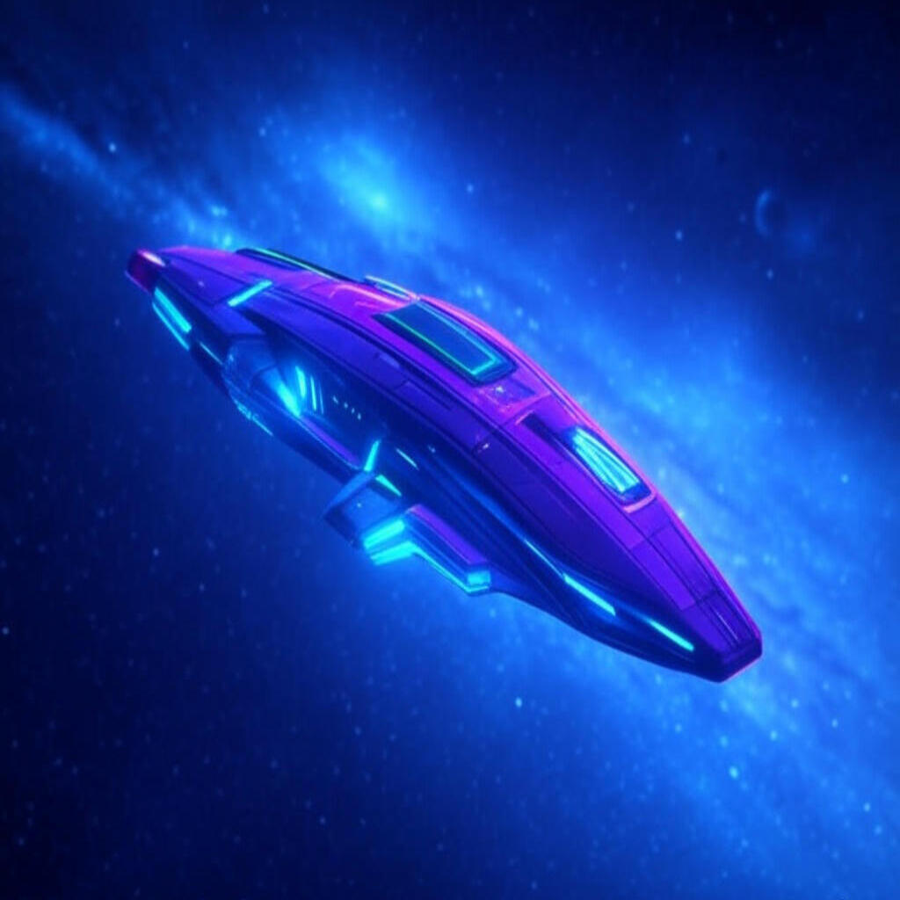

🌌 Galaxy Simulation Game

About the Project

Galaxy Simulation is a space simulation game where you can explore the universe and visit various celestial bodies across the galaxy. Developed using Flutter, this game offers a unique interstellar adventure!

🚀 Features

Explore planets, stars, and other celestial objects with your spacecraft

Interact with a variety of space phenomena:

🌎 Habitable Planets

☁️ Gas Giants

🌀 Black Holes (watch out!)

☄️ Meteor Fields

🏢 Space Stations

Manage resources and grow your economy

Upgrade your ship:

⛽ Fuel Efficiency

🔄 Collection Speed

🛡️ Black Hole Resistance

Complete missions to earn rewards

Encounter random galactic events

📱 Screenshots

Screenshots will be displayed here

🔧 Technologies

Flutter (SDK v3.0.0+)

Provider (State Management)

Dart

⚙️ Installation

1. Install the Flutter SDK: Flutter Installation Guide

2. Clone the repository:

git clone https://github.com/ycagdass/Galaksi-Simulasyonu.git

3. Install dependencies:

flutter pub get

4. Run the app:

flutter run

🎮 How to Play

1. Tap on celestial bodies on the galaxy map to move your spacecraft

2. Collect resources from planets

3. Use collected resources to upgrade your ship

4. Complete missions to earn additional rewards

5. Avoid dangerous black holes and meteor fields

🛣️ Roadmap

[ ] New types of celestial bodies

[ ] More diverse mission types

[ ] Multiplayer mode

[ ] Sound effects and music

[ ] Improved animations

📄 License

This project is licensed under the MIT License. See the LICENSE file for more information.

🤝 Contributing

We welcome contributions! Please open an Issue to discuss your changes before submitting a Pull Request.

👤 Developer

@ycagdass (front-end and IoT developer)

---

⭐️ If you like this project, don't forget to give it a star! ⭐️
